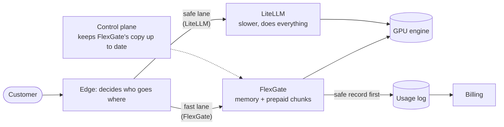
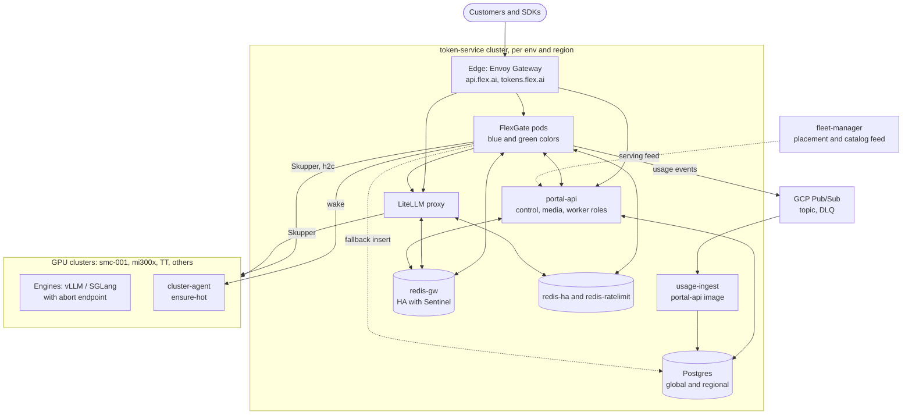
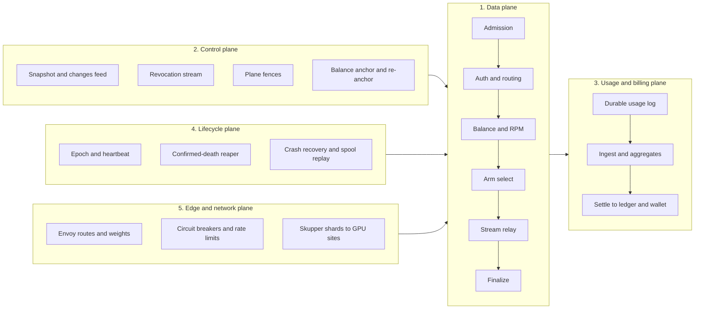
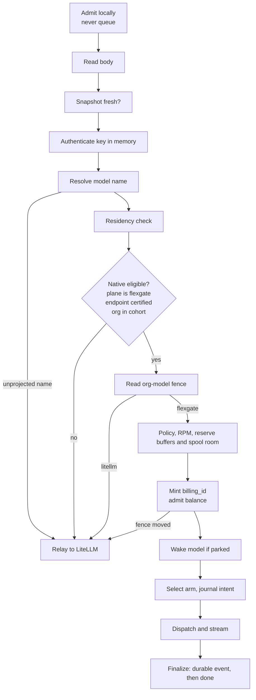
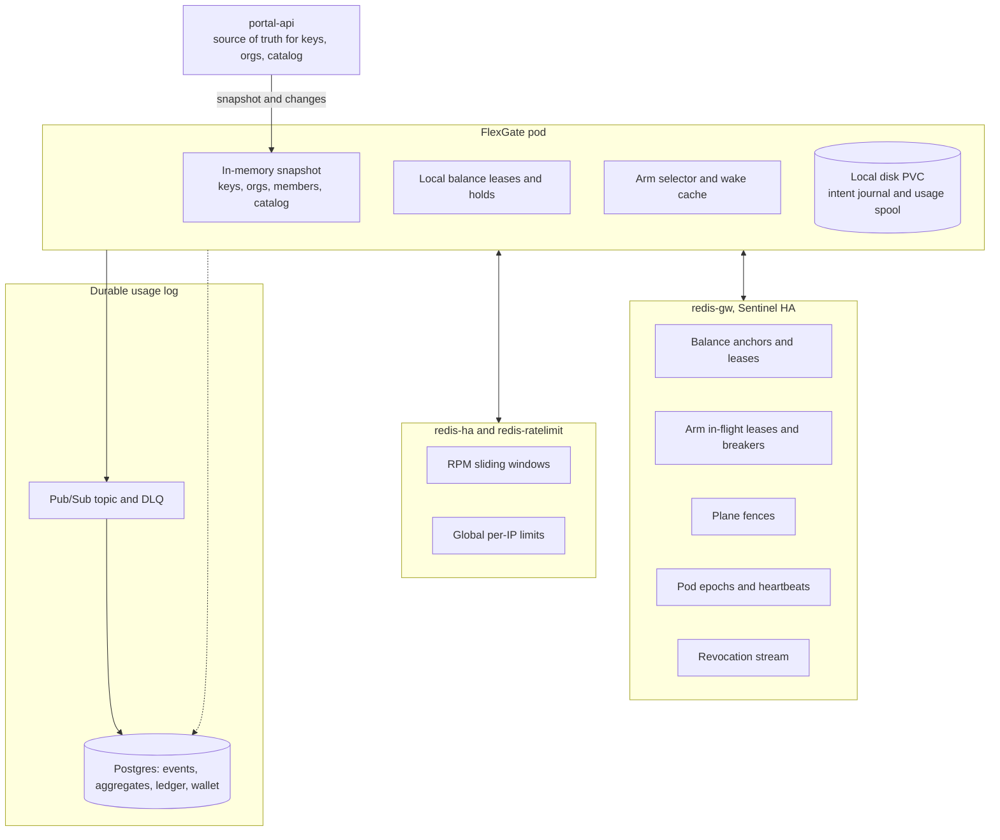
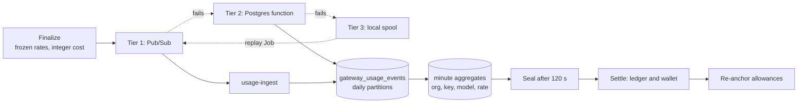
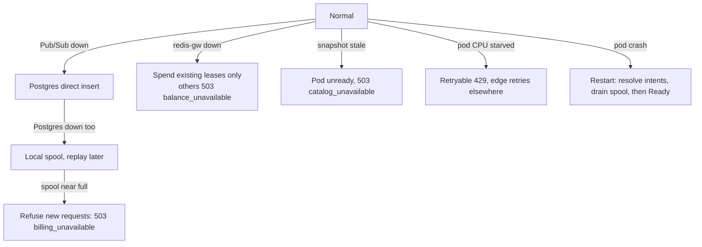
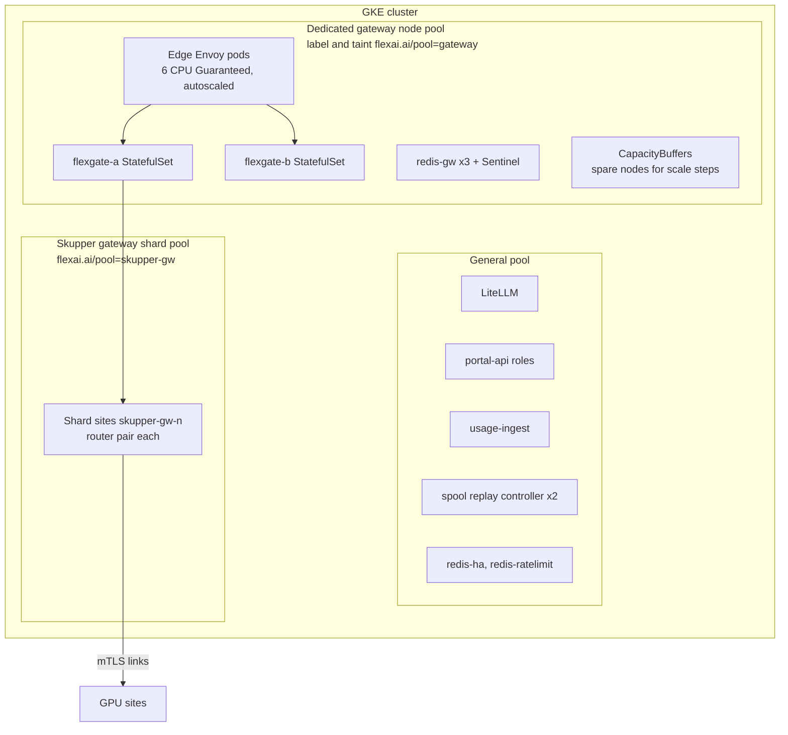
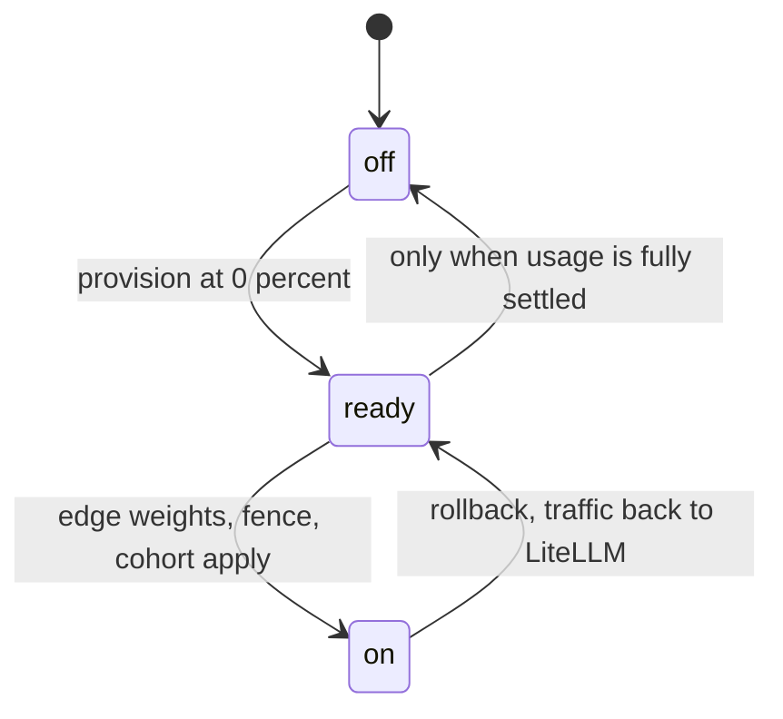
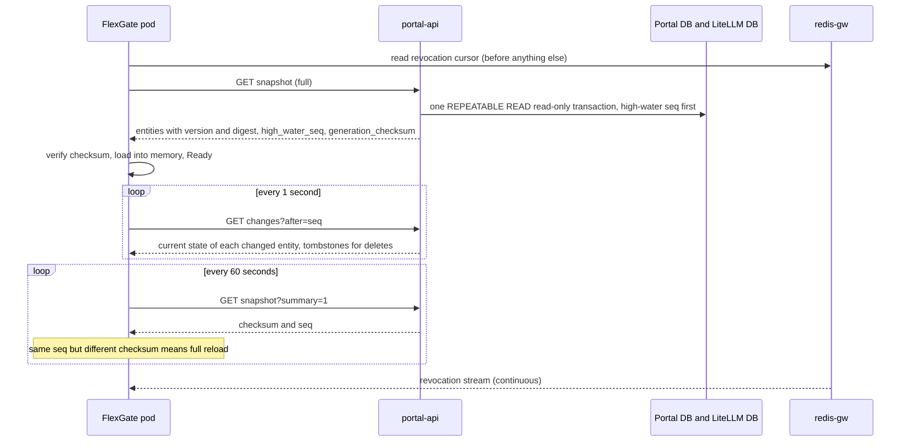

# FlexGate: Architecture, System Design and Infrastructure

An architecture-level guide to FlexGate, the Go gateway that runs beside LiteLLM in `token-service`. It covers what problem it solves, how the system is shaped, where state lives, how money stays correct, how it fails, and the infrastructure it needs.

**Sources.** The Go code (`token-service/flexgate/`), the Helm chart and its values, `docs/runbook-flexgate.md`, `docs/designs/flexgate-billing.md`, the **v2 design document** (`docs/designs/flexgate.md`, 2,110 lines), the C1 control-plane Python code, and the infra repo (`k8s/`, `pulumi/gcp/token-service/`). I also inspected live clusters read-only on 2026-10-05.

**Where the design and control plane live.** The v2 design doc and the control-plane code are **not on `main`**. They are in open pull requests: #2155 (design, branch `brijesh/flexgate-design`), #2192 (C1 control plane, `brijesh/flexgate-c1-control-plane`) and #2196 (combined integration, `brijesh/flexgate-integration`). I read them directly from git without checking them out. The Go module skeleton (#2198) and the chart component (#2160) are merged.

**Confidence.** Anything cited to the design doc is the owner's stated intent. Where I describe a *current* state (what is deployed, what is merged), I observed it. **(inferred)** marks my own interpretation.

## Contents

0. [Start here: FlexGate explained simply](#0-start-here-flexgate-explained-simply)
1. [Summary](#1-summary)
2. [The problem and design goals](#2-the-problem-and-design-goals)
3. [System context](#3-system-context)
4. [Logical architecture: five planes](#4-logical-architecture-five-planes)
5. [Request path design](#5-request-path-design)
6. [State and data design](#6-state-and-data-design)
7. [Money correctness](#7-money-correctness)
8. [Failure model and degradation](#8-failure-model-and-degradation)
9. [Infrastructure and deployment topology](#9-infrastructure-and-deployment-topology)
10. [Environments, regions and what is live](#10-environments-regions-and-what-is-live)
11. [Rollout and migration strategy](#11-rollout-and-migration-strategy)
12. [Security design](#12-security-design)
13. [Observability and alerts](#13-observability-and-alerts)
14. [Why both LiteLLM and FlexGate](#14-why-both-litellm-and-flexgate)
15. [Risks and open gaps](#15-risks-and-open-gaps)
16. [The control plane in depth](#16-the-control-plane-in-depth)
17. [Map: code and infra](#17-map-code-and-infra)

---

## 0. Start here: FlexGate explained simply

Read this section first. The rest of the document is the detail behind it.

### The one-sentence version
FlexGate is a **faster front door** for AI requests. It checks who you are, whether you can pay, and which GPU should answer, and it does that in a few microseconds from memory, instead of asking a slower system every time. The old front door (LiteLLM) stays open next to it as the safe fallback.

### An analogy
Imagine airport border control.

- **LiteLLM** is one big hall with human officers. Every traveller goes through, and each officer looks things up in paper files and fills in forms. It is flexible and correct, but each traveller takes a lot of officer time, so the hall cannot handle a hundred times more travellers.
- **FlexGate** is a row of **automated e-gates**. Each gate carries a printed copy of the watch-list in its own memory, so it does not phone anyone to check a passport. Each gate also holds a **small prepaid allowance** so it can wave people through without calling the bank for each one. It is much faster.
- **The border map (Envoy edge)** decides how many travellers go to e-gates versus the hall. At first it sends **zero** to the e-gates. Then 1%, then more. If anything looks wrong, it sends everyone back to the hall.
- **The rule that matters most:** an e-gate never lets someone through unless the receipt of the visit has been safely **written down** somewhere. If the record book is unavailable, the gate says "sorry, try again" rather than letting someone through unrecorded.

### Why it exists (with numbers from the design doc)
- Today production handles roughly **1 request per second on average** and about **22 at the busiest moment**.
- The goal is **100 times that peak: about 2,200 requests per second** (and the system is built for 4,400).
- LiteLLM costs about **175 CPU-milliseconds per request plus 523 per thousand tokens**. At 100× that is roughly **2,200 CPU cores just for LiteLLM**. The design says plainly it "cannot stay on the path".
- The time a request spends before it reaches a GPU is today about **136 ms typical and 5.4 s at the slow end**. The target is **under 1 ms typical and under 5 ms at the slow end**.
- A partner (OpenRouter) counts server errors against our uptime but not "please retry" answers, so overload must become a quick, polite 429, never a 5xx.

So FlexGate is **built for a future load**, not because today's traffic needs it.

### The six big ideas, in plain words
| Idea | In plain words |
|---|---|
| **1. Keep the rulebook in memory** | Each FlexGate pod holds a copy of every API key, customer and model. It updates its copy from a change feed. It never asks a database per request. |
| **2. Pre-pay small chunks** | A customer's balance is split into short-lived chunks ("leases") handed to pods. A pod spends from its chunk without asking Redis each time. Overspend is capped by the size of the chunks. |
| **3. No record, no answer** | The usage record must be safely stored before the response finishes. If every place to store it is down, the request is refused, not served for free. |
| **4. Always keep a way back** | LiteLLM still works. If a request is unusual, or the switch is flipped back, it goes to LiteLLM. |
| **5. One owner at a time** | For each customer and model, exactly one of LiteLLM or FlexGate is in charge of spending that balance, controlled by a marker called a **fence**. |
| **6. Refuse fast, never queue** | If a pod is full, it answers "429, try another pod" in milliseconds. It never makes callers wait in a queue. |

### One request, in plain steps (illustrative numbers)
Suppose Priya's company has **$10** prepaid and calls a chat model.

1. The request reaches a FlexGate pod. The pod checks it has room, then **looks up her API key in its memory** (about a microsecond).
2. It checks the model exists and she is allowed to use it. It checks she has not exceeded her requests-per-minute.
3. It checks her balance. The pod already holds, say, a **$1 chunk** of her $10. The request could cost at most 2 cents, so it **reserves 2 cents of that chunk**. No network call needed.
4. It picks a GPU deployment for the model, and writes a note in its own journal on disk: "I am about to send request X". That note is saved to disk before anything is sent.
5. It forwards the request to the GPU and streams the answer back to Priya, chunk by chunk.
6. When the answer ends, the pod computes the real cost, say 0.7 cents, and **publishes a usage record** to a message queue. If the queue is down it tries the database, then its own disk.
7. **Only after the record is safely stored** does the pod send the final "done" to Priya. The unused part of the reservation goes back into the chunk.
8. In the background, usage records are grouped by minute and turned into charges against her balance, and her chunk is topped up.

If any step before 5 fails, nothing was charged. If the pod crashes between 4 and 7, the journal note lets the next pod find out what happened and settle it.

### What if something breaks?
- **Record queue down:** write to the database; if that is down too, to local disk; if disk is full, refuse new requests.
- **Redis (shared coordination store) down:** pods keep spending the chunks they already hold; others get a clear 503.
- **Pod overloaded:** quick 429, the edge retries on another pod.
- **Pod crashes:** it restarts, reads its journal, settles anything unfinished, and only then accepts traffic.
- **Anything odd about FlexGate itself:** flip the mode back and everything returns to LiteLLM.

### Where it stands today (October 2026)
- The code is largely **built**. Parts are merged to `main`; the part that feeds it data is **still in open pull requests**.
- It is **running only on the US dev environment, and not serving any customer traffic**. That dev instance is currently unhealthy because the missing data feed is not deployed (section 10).
- **Staging and production do not run it at all.**
- Several items must be finished before the first production traffic (section 15).

### A simple picture

---

## 1. Summary

- **What it is.** A Go data plane for the four generation endpoints: chat, completions, embeddings, responses. For each request it either **serves it natively** (auth, rate limit, balance, engine selection, streaming, usage event) or **relays the raw request to LiteLLM**.
- **Shape.** A stateless-looking request path made fast by keeping hot state in memory (an authoritative snapshot) and in per-pod leases, with all durable state pushed to Redis, Pub/Sub, Postgres and a local disk journal.
- **Design stance.** Fail closed on anything involving money or identity. A response is never completed unless its usage record is durable.
- **Rollout stance.** It is introduced gradually: per environment (mode), per path (edge weight), per org (cohort) and per model (fence). LiteLLM remains the always-available fallback.
- **Status.** Implemented in code. Deployed only on **US dev**, in `ready` mode (0% traffic), where the pod is currently **not Ready** because the control-plane half it needs is not on `main`. Staging and prod have it off, in both US and EU (section 10).

---

## 2. The problem and design goals

This section is taken from the v2 design doc (PR #2155, "a thin, compiled data plane for 100× request rate", status: design v2 for review, 2026-09-25, owner: brijesh).

### The target

| Quantity | Today (prod) | Design target (100× peak) | Built to (2× target) |
|---|---|---|---|
| Generation requests/s | 21.6 peak, 1.11 mean | 2,200 | 4,400 |
| Concurrent SSE streams | about 700 peak (design's estimate) | 66,000 | 132,000 |
| Output tokens/s through the path | about 35K | 3.5M | 7M |

### What dominates cost at 100× (measured unit costs, per the doc)

| Layer | Unit cost | At the target | Verdict in the doc |
|---|---|---|---|
| LiteLLM | 175 CPU-ms/req + 523 CPU-ms per 1K tokens | about 2,200 cores | "Cannot stay on the path" |
| Edge Envoy | 4.7 CPU-ms/req + 94 CPU-ms per 1K chunks | 160 cores (52 after batching chunks) | Scale out on a dedicated pool |
| Skupper, per router tier | 64 CPU-ms per 1K tokens | 224 cores per tier | **The binding constraint**; shard it and remove the hub from the data path |
| Redis | 1 to 4 CPU-ms per request (inferred in the doc) | up to 11K ops/s on the balance Redis | Two instances sized to built-to |
| Usage pipeline | scanner ceiling 2,500 rows/s | 2,200 events/s, 190M rows/day | Scanner is below target; use aggregates |

The doc's own conclusion: *"A plan that only replaces LiteLLM still fails at 100×. This design covers the whole path."* That is why the design also touches the edge, Skupper topology, Redis and the usage pipeline, not just the gateway process.

### Gateway SLOs the design commits to
- **Overload is never a 5xx.** It is a 429 with `Retry-After`, returned within 5 ms for locally decided rejects. Reason: OpenRouter's uptime counts 5xx, 401, 402, 404 and mid-stream errors against us, but not 429 or 400.
- **Pre-dispatch overhead:** p50 under 1 ms and p99 under 5 ms. Today it is p50 136 ms and p99 5.4 s.
- **No gateway-generated 504 from pre-dispatch budget exhaustion** at any load up to built-to.
- **Billing:** every dispatched request produces exactly one usage event; a success's final bytes go out only after the event is durable; **we never charge for an undelivered response**.
- **Time to capacity:** zero seconds up to a "warm floor" (twice the trailing peak, or declared partner capacity, whichever is larger). Above it, autoscaling reacts in about 30 s, and the gap is answered with fast 429s.

### Alternatives the design considered and rejected
| Option | Why not |
|---|---|
| Envoy `ext_proc` filter | One gRPC message per body chunk: about 50 to 130 cores at 1.6M chunks/s; cannot modify the stream in observe mode; open truncation bugs. |
| Envoy AI Gateway | Blocking round trip per streamed chunk; needs a newer Envoy Gateway than prod's 1.5.2; no key store, prepaid gate or custom Lua. |
| Envoy dynamic modules | Stable only in Envoy 1.38, which needs a newer Envoy Gateway. |
| agentgateway | A second data plane that charges budgets only after the response and still needs `ext_authz`. |
| Bifrost, TensorZero | Plugin ABI breaks silently; TensorZero is archived. |

The chosen shape is a purpose-built **Go service behind the existing Envoy**, which keeps every per-chunk operation in-process at a few microseconds. Envoy stays because it already owns TLS, the load balancer integration, route config and edge alerts, and its route weights are the cutover and rollback switch. Language choice (Rust versus Go) and "build on an existing gateway instead" remain open questions the doc lists for the owner (OG52).

A 2026-08-17 incident (Envoy connection limits overflowing on LiteLLM's route) is cited in the chart as an example of edge fragility.

### Goals visible in the design

| Goal | How the design serves it |
|---|---|
| Much lower CPU per request | Go, in-memory auth and catalog, per-pod balance leases, few Redis calls on the common path. |
| Predictable overload behaviour | One admission point that never queues; a single retryable 429 shape. |
| Billing that cannot silently lose or double count | Frozen price at request time, idempotent events keyed by `billing_id`, durable-before-complete, voids. |
| Zero-downtime coexistence with LiteLLM | Relay path, fences, cohorts, per-path weights, byte-identical errors. |
| Operability at scale | Blue/green pods, crash recovery, autoscaling on admission load, dedicated node pool, shard-able network. |

**Non-goals.** It does not replace LiteLLM's key/spend tables or admin API, it does not serve media endpoints (portal-api does), and it does not own model placement (fleet-manager does).

---

## 3. System context

FlexGate's neighbours:
- **Envoy Gateway** in front, deciding per path how much traffic goes to FlexGate and how.
- **portal-api** as its control plane: it serves the snapshot and changes feed, runs the balance anchoring and the usage consumer.
- **LiteLLM** as the relay target and the owner of key and spend tables.
- **redis-gw, redis-ha, Pub/Sub, Postgres, local disk** as state stores (section 6).
- **GPU clusters** reached through **Skupper**. FlexGate talks to engines directly and to the cluster-agent for wake.
- **fleet-manager** upstream: its serving feed decides which models and arms exist, which reaches FlexGate through the catalog snapshot.

---

## 4. Logical architecture: five planes

| Plane | Responsibility | Where it lives |
|---|---|---|
| **Data** | Serve or relay a request, end to end. | FlexGate Go binary. |
| **Control** | Keep the data plane's view of keys, orgs, models and balances correct; decide who owns traffic. | portal-api (Python) and redis-gw. **The control-plane code is on feature branches, not on `main`.** |
| **Usage and billing** | Turn events into money exactly once. | FlexGate publisher, Pub/Sub, `usage-ingest`, Postgres, `billing_spend_sync`. |
| **Lifecycle** | Pod identity, liveness, cleanup of dead pods, recovery of crashed work. | FlexGate plus Kubernetes API plus redis-gw. |
| **Edge and network** | Route, protect, and reach engines. | Envoy Gateway, Skupper, GKE. |

The separation matters: the data plane keeps working on its last good snapshot and its existing leases if the control plane is briefly unavailable, but **fails closed** once the snapshot is too old or leases are exhausted.

---

## 5. Request path design

### 5.1 Decision flow

### 5.2 Key design decisions

| Decision | Why | Trade-off |
|---|---|---|
| **Native or relay per request**, not a hard cutover | Safe, reversible migration. Anything uncertified or unknown goes to LiteLLM. | Two code paths must stay behaviourally identical. |
| **In-memory snapshot** instead of a DB or LiteLLM call per request | Removes the dominant per-request latency and load. | Needs a control plane, staleness limits and a revocation channel. |
| **Admission never queues** | Overload becomes a cheap, retryable 429 answered before any work. | Clients and the edge must handle retries. |
| **Per-pod balance leases** | Avoids a Redis round trip per request while bounding overdraft. | Overdraft is bounded, not zero (section 7). |
| **billing_id minted by the gateway** (UUIDv7) | One key from request through event to per-request lookup; also encodes the partition day. | The old LiteLLM-plane id mismatch remains for that plane. |
| **Durable before complete** | No completed response without a recorded event. | A fully failed usage log blocks new requests (503) rather than risking loss. |
| **Frozen price per request** | Billing is exactly what the customer was shown at request time. | A rate change shows up as a mismatch alert, not a bill change. |
| **Byte-identical errors vs Python** | Clients cannot tell which plane served them. | Every Python hook change must be mirrored in Go. |
| **h2c to engines, connection reuse** | Fewer connections, less handshake cost. | Needs engines and Skupper that carry h2c; some arms use HTTP/1.1. |

### 5.3 Overload and admission design
Five local limits are checked before any real work: pre-dispatch count, active streams, buffered bytes, ingress byte rate and a CPU-calibrated work rate. A request relayed to LiteLLM uses a **separate, smaller pool**, so a slow LiteLLM cannot starve native capacity. An overload probe tells "this pod is CPU-starved" from "Redis is down": a Redis deadline missed because the pod itself is starved becomes the retryable 429 (the edge retries on another pod); a real Redis failure stays a 503. This keeps autoscaling signals and client behaviour honest.

---

## 6. State and data design

Where each piece of state lives, and why.

| State | Store | Why there |
|---|---|---|
| Keys, orgs, members, model catalog, arms | **In pod memory**, sourced from portal-api | Needed on every request; must be fast and survive brief outages. |
| Balance allowance and leases | **redis-gw** (anchors), pod memory (active lease) | Shared across pods and stacks; Lua scripts make grants atomic. |
| Arm in-flight slots, breaker state | **redis-gw** | Capacity limits must be global across pods. |
| Plane fences | **redis-gw** | Both LiteLLM (v4 hook) and FlexGate must read the same value. |
| Pod epochs, heartbeats | **redis-gw** | Enables confirmed-death cleanup. |
| RPM counters | **redis-ha** | Shared with LiteLLM and portal-api so each request counts once. |
| Intent journal, usage spool | **Local PVC**, `ReadWriteOncePod`, fsynced | Survives a crash; second line of durability. |
| Usage events | **Pub/Sub**, then **Postgres** | Decouples the hot path from DB write rate; DLQ for bad records. |
| Aggregates, ledger, wallet | **Postgres** (regional) | Billing source of truth. |
| Org, billing account, legal entity | **Postgres global schema** | Global plane; no SQL may join global and regional. |

**Postgres topology.** token-service splits a `global` schema (identity, billing accounts, ledger) from regional tables (keys, usage, wallet). FlexGate's events and aggregates are regional. Regional stacks (EU) reach the global plane through an internal API instead of joining tables.

**Snapshot design.** Entities are versioned, with tombstones so a stale re-create cannot resurrect a deleted key. The catalog swaps atomically (lock-free reads). Emergency revocation travels on a separate Redis stream whose cursor is read **before** the first load, so a revoke racing the load is never missed. A snapshot older than the configured age makes the pod unready and requests fail with 503.

---

## 7. Money correctness

The design goal: **never charge for what was not delivered, never lose a charge for what was, never spend one balance from two places unsafely.**

### 7.1 Balance admission
- Redis holds the anchored allowance per scope (org, member, key).
- Each pod leases a share: `min(Cap, remaining / (K × pods leasing))`, TTL 30 s, renewed every TTL/3 with the spend since the last report. A pod stops using a lease at 90% of TTL measured from when the call was sent.
- Admission is local against the lease, with an **upper-bound hold** for the request. Small balances use atomic **direct holds** in Lua.
- If Redis is down, pods spend only what they already leased; scopes without a lease answer 503.
- **Overdraft bound** = outstanding leases + estimate error on direct holds + any ingest-lag breach. Bounded, not zero.

### 7.2 One plane at a time (the fence)
A fence per `(org, model)` in redis-gw says whether LiteLLM or FlexGate owns that traffic. Moving a model is an operator action and is refused unless every LiteLLM pod runs the v4 fence hook and the org's balance is anchored. If a fence flips mid-request, FlexGate refunds its RPM entry, releases holds and relays to LiteLLM, so exactly one plane counts and bills it.

### 7.3 Event pipeline

- **Idempotent.** Events are keyed `(event_day, billing_id)` with `ON CONFLICT DO NOTHING`; only newly inserted rows join aggregates.
- **Aggregated billing.** One row per `(org, key, model, rate, minute)` instead of one per request, which would be billions of rows a day at target scale.
- **Cost verified twice** (consumer and database) against billing's own formula.
- **Fault-aware billing.** Gateway faults are never charged; engine and client faults bill only tokens actually delivered; a disconnect that delivered nothing still bills the prompt.
- **Voids** cancel an event that may already be stored when the client got an error. Before settlement it makes the event non-billable; after, it becomes an idempotent wallet credit.
- **Retention.** 35 days hot. An export-before-drop writer is not implemented yet.

### 7.4 Durable before complete
A request reserves room for its event in the local spool **before** dispatch, writes an **intent** to the journal (fsync) before any byte goes upstream, and the response is only completed after the event is acked by some tier. This closes the loss window between "engine did the work" and "we recorded it".

---

## 8. Failure model and degradation

| Failure | Behaviour | Design intent |
|---|---|---|
| Usage log tier fails | Fall through Pub/Sub, Postgres, spool. | Durability over speed. |
| All tiers fail at commit | Client gets 503, not a completed response. | Never complete an unrecorded request. |
| redis-gw unavailable | Existing leases spend; others 503; exempt orgs admitted and counted. | Bound exposure, keep paying customers' existing capacity. |
| Snapshot stale/missing | Unready; 503. | Never auth against stale data. |
| Pod starved | 429 retryable. | Don't let overload look like outage. |
| Pod crash | Same-ordinal restart recovers intents via the engine's recovery endpoint, closes the old epoch. Orphan volumes are drained by replay Jobs. | No lost billable work. |
| Pod dies holding leases | Reclaimed as fully spent after a **confirmed** death (no heartbeat **and** no pod with that UID in Kubernetes). | Conservative direction; avoids reclaiming a live pod behind a partition. |
| Client disconnect during commit | Publish is not cancelled. | Usage is still recorded. |
| Undecodable spool record | Quarantined, never deleted; runbook for manual re-ingest. | Billable data is never discarded. |
| Fence moves mid-request | Release holds, refund RPM, relay to LiteLLM. | Single plane counts it. |

---

## 9. Infrastructure and deployment topology

### 9.1 Runtime layout in a token-service cluster

### 9.2 Component by component

| Component | Design | Why |
|---|---|---|
| **Compute: FlexGate** | Two StatefulSets (`flexgate-a`, `flexgate-b`), anti-affinity and topology spread, at most one pod per color per node, PodDisruptionBudget. | Blue/green; one pod per node isolates failures and keeps predictable CPU. |
| **Dedicated node pool** | `flexai.ai/pool=gateway`; chart refuses `ready`/`on` without a `nodeSelector`. | Keeps edge and gateway off noisy neighbours. |
| **CapacityBuffers** | GKE CapacityBuffers hold spare nodes: one scale step = N spare edge nodes + M spare flexgate pods per cluster. | A scale-up lands on an existing node instead of waiting for node boot during the burst. |
| **Autoscaling** | HPA/KEDA on CPU (target 60%) and optionally on `flexgate_admission_utilization`; warm floor = max(2× trailing peak, declared partner capacity) over headroom × measured per-pod ceiling. | Per-pod caps shed cheaply, so CPU alone can sit below target; admission utilization scales before caps bind. |
| **Edge (Envoy Gateway)** | Chart-owned Gateway per env; separate HTTPRoutes and BackendTrafficPolicies for FlexGate; breaker sized from fleet admission limits; per-source-IP flood guard; optional response override to a capacity 429. An infra-owned second Gateway serves `api.flex.ai`. | Separate clusters mean separate breaker counters; every `/v1` carve-out must be made in both repos. |
| **Edge pods** | Autoscaled "Guaranteed" edge: 6 CPU / 8 Gi, min 2, max 8 in the example I read. | The edge must not be the first thing to saturate. |
| **Network to engines (Skupper)** | Today: edge, then a backoffice hub, then the GPU site (3 router hops). The designed fix is **sharded public Skupper sites** (`skupper-gw-n`, HA router pair each, on a dedicated pool) that GPU sites dial directly, removing the hub hop. Hot models are spread across shards via K aliases. | A Skupper site cannot scale by replicas; scale means more sites. `shard_count` was 0 where I looked, so treat this as designed or partial, not universal. |
| **redis-gw** | 3 replicas, Sentinel quorum 2, `downAfter` 10 s, PDB minAvailable 2, spread by node and zone, password required (init guard refuses to start without a ≥32-byte password), preferred placement on the gateway pool. | Balance, arm and fence state must not depend on one Redis process. |
| **redis-ha / redis-ratelimit** | Separate Redis for RPM and global per-IP limits. | Shared with LiteLLM and portal-api; isolates it from gateway coordination state. |
| **Usage log** | GCP Pub/Sub topic, ingest subscription, DLQ topic and subscription per environment, all `protect=True` in Pulumi. | Durable, decoupled from DB write rate; DLQ holds billing records. |
| **Postgres** | Existing portal Postgres plus a SECURITY DEFINER function (`gw_ingest_events`) as the direct fallback, granted to a dedicated `flexgate_usage` role. | Fallback tier with minimal privileges. |
| **Local disk** | PVC per pod, `ReadWriteOncePod`, holds journal and spool. | Last-resort durability and crash recovery. |
| **Spool replay** | Leader-elected controller Deployment launching `flexgate replay` Jobs for orphaned PVCs. | Drains usage left by dead pods. |
| **Secrets** | OpenBao via Vault Secrets Operator. `flexgate` bag (including `USAGE_DATABASE_URL`) per cluster, and the abort token on its own path. | OpenBao cannot scope a policy to one key, so the abort token is isolated from the DB DSN. |
| **Abort token on GPU clusters** | Every accelerator cluster (including BYOC) gets a synced token set, **one token per flexgate environment** (six), read from the OpenBao that holds each. Engines re-read the files per call and answer 503 `abort_unconfigured`, never open. | FlexGate calls the engine to cancel generation on client disconnect; all envs reach the same engine arms. |
| **Workload Identity** | Publisher and subscriber are separate GCP identities. A ValidatingAdmissionPolicy reserves each env's identities to its own cluster. | All clusters share one WI pool, so a ServiceAccount named like prod's on dev would otherwise *be* the prod publisher or subscriber. Residual risk: cluster-admins can delete the policy. |
| **Observability** | VMRules per cluster (below), metrics on `:9090`, distributed tracing through Envoy. | Section 13. |

### 9.3 Blue/green and storage
- `flexgate-active` Service selects only the active color; `flexgate` selects both for scraping.
- Template changes never roll a live color (`partition: 2147483647`). A color adopts a new template only at 0 replicas, so every release goes through the idle color. The chart refuses to flip `activeColor` while the new color has fewer Ready pods than the old or than the warm floor.
- Drain: readiness fails at once, listeners stay open for propagation, in-flight streams finish within `maxStreamSeconds + 60`, leases are returned. Grace is sized so preStop, propagation and exit fit inside the margin.
- Format-changing releases require every spool drained first, because a binary cannot replay a format it does not read.

### 9.4 Infra-side ownership (who provides what)
| Owner | Provides |
|---|---|
| **infra repo, Flux** | HelmReleases and pins, redis-gw, edge Gateway, Skupper shard sites, CapacityBuffers, usage-log identity guard, abort-token releases on GPU clusters, alert rules. |
| **infra repo, Pulumi** | GKE and node pools, Pub/Sub topics/subscriptions/DLQ/IAM, Cloud SQL, OpenBao policies. Pub/Sub exists only once the env's `flexgateMode` is `ready` or `on`. |
| **token-service repo** | The binary, the chart, the Python control and billing planes, the runbook. |
| **fleet-manager** | Model and arm catalog, engine-side abort endpoints (via runtime), cluster-agent wake. |

---

## 10. Environments, regions and what is live

Six token-service environments, in US and EU. Infra decides each env's mode with one field, `flexgateMode` (`off`, `ready`, `on`), which defaults to `off`. In `clusters.yaml` only **US dev** sets it (`ready`).

| Environment | Cluster / namespace | FlexGate |
|---|---|---|
| US dev | `k8s-token-service-gcp-dev-INFRA-DEV` / `token-service` | `ready` |
| EU dev | `k8s-backoffice-gcp-eu-1-INTERNAL-PROD` / `token-service-dev` | off |
| US staging | `k8s-backoffice-gcp-1-INTERNAL-PROD` / `token-service` | off |
| EU staging | `k8s-backoffice-gcp-eu-1-INTERNAL-PROD` / `token-service` | off |
| US prod | `k8s-token-service-gcp-1-CLIENT-PROD` | off |
| EU prod | `k8s-token-service-gcp-eu-1-CLIENT-PROD` | off |

Infra comments state that EU staging and EU dev cannot leave `off`, and that flexgate-related infra pieces (redis-gw HA, capacity buffers, identity guard, Pub/Sub, ingest) render only from the env's mode. Several are shared across a pool of clusters because they share one GCP project and Workload Identity pool.

### US dev, in detail
- **Config.** `mode: ready`, `activeColor: a` with 1 replica (`b` at 0). Chat route weight 100 (ignored in `ready`). Cohort is one org; plane models are `p1-fake-engine` and `gemma-4-31b-it`. Workloads present: `flexgate-a`, the replay controller (2 pods) and `usage-ingest`.
- **Parked by decision.** An infra comment (owner, 2026-09-28) says verification v2 is done and dev was "handed back" at `ready` so it can run the main-channel build. It is deliberately not `off`, because `off` would also drop redis-gw there. "Resume from here: pin, then on."
- **Current health.** `flexgate-a-0` has run 4d11h and is **not Ready**: `/readyz` reports `snapshot_not_loaded` and snapshot loads have failed 76,947 times. portal-api answers **404** to `GET /internal/v1/gateway/snapshot`.
- **Why that 404.** The snapshot route (and `gateway_balance`, `gw_changelog`, `gw_fence`, migration 415) exist only on `origin/brijesh/flexgate-c1-control-plane` and `…/flexgate-integration`, not on `main`. Dev's portal-api image comes from whatever branch is currently pinned; the latest pin when I looked (2026-10-04) was an unrelated branch. I could not match the image's commit hash to a known commit, so the pin explanation rests on timestamps and the pin log.
- **Healthy parts.** redis-gw (3/3 pods) and `usage-ingest` (pulling from its Pub/Sub subscription) look healthy. Redis timeout lines in the pod log follow Sentinel failovers.
- **Impact.** At 0% traffic there is no customer impact. If the control plane is enabled while `gateway_balance` is missing, the billing settle path would raise on use. I saw no such error, and no gateway traffic is flowing.

---

## 11. Rollout and migration strategy

Rollout has four independent dials, from coarse to fine:

1. **Environment mode** (`off`, `ready`, `on`). `ready` provisions everything at 0% traffic. Never skip it. Rollback is `on` to `ready`.
2. **Edge weight per path** (0, 1 to 99, 100). Different Envoy routes and retry policies per range.
3. **Org cohort** (`basisPoints` and explicit org list). Orgs outside it are relayed.
4. **Model fence per org** (`litellm`, `draining`, `flexgate`). Operator-driven, guarded.

Ordering rules that matter architecturally:
- **LiteLLM must run the v4 fence hook everywhere before any model moves.** A pre-v4 hook ignores the fence and would let the same balance be spent from two planes. Before rolling LiteLLM back below v4, move every model back first.
- **Weights apply only in `on`.** The chart refuses to create a weighted route before the active color's StatefulSet exists.
- **Gating work before the first prod weight step** (per the billing design): migrate remaining usage readers (dashboard logs, realtime usage, RPM trend, public metrics) to include gateway traffic, run the Cloud SQL ingest load test, and build the export-before-drop writer.

---

## 12. Security design

- **Authentication in memory.** SHA-256 of the key against the snapshot, with LiteLLM's exact extraction rules and 401 texts. Unknown keys sit in a bounded negative cache, so key-guessing floods are cheap.
- **Revocation.** A dedicated Redis stream, read before the first snapshot so revokes are never missed.
- **Fail closed.** Missing snapshot, missing balance anchor, exhausted spool and unreachable fence all refuse rather than guess.
- **Data residency.** An EU stack fails closed for an unknown org or a foreign region, independent of LiteLLM.
- **Information hiding.** Error bodies and headers are scrubbed and match LiteLLM's; edge routes remove internal markers such as `x-envoy-ratelimited`.
- **Least privilege.** The snapshot call uses a projected ServiceAccount token (audience `flexgate-snapshot`) validated through TokenReview against an allow-list of ServiceAccounts. The usage fallback role has `EXECUTE` on two functions only, no table rights. Publisher and subscriber are separate identities, and the admission policy protects them from impersonation across clusters.
- **Abort path.** Engines accept only configured bearer tokens, compared in constant time; none configured means 503, never open.
- **Secrets.** OpenBao through VSO, with the abort token isolated from the DB DSN.
- **Residual risks called out in infra.** The shared GCP Workload Identity pool means cluster-admin on a non-prod cluster could undo the admission policy; the complete fix (a project or pool per env) is an open owner decision.

---

## 13. Observability and alerts

- **Metrics** on `:9090` (`/metrics`, `/livez`, `/readyz`), scraped through the `flexgate` Service so a draining color stays scraped. A NetworkPolicy (when enabled) allows only the edge namespaces and the scraper.
- **Readiness reasons** are explicit strings: `snapshot_not_loaded`, `fence_unchecked`, `fence_unreadable`, `uncertified_fence_on_flexgate`, and so on.
- **Alert rules** (VMRules in infra, ungated, per cluster) include: gateway 5xx, billing unavailable, balance unavailable, admission saturated, snapshot stale, metrics missing, usage spool non-empty/filling/orphaned, usage unrecovered/unrecorded, tier fallback, Redis errors, usage event gap (with gap-check missing/stale), rate-version mismatch, partitions low, edge delivery gap, finalize metrics missing, delivery unmeasured. Billing-side alerts cover re-anchor backlog and stall, settlement stall and sealing stall.
- **Tracing.** The edge forwards the inbound `traceparent`; engine spans join the gateway's trace.
- **Known gap.** US dev's unready pod has been failing for days; I did not find anything that escalated it, though staging and prod rules are the ones that page.

---

## 14. Why both LiteLLM and FlexGate

**Short answer.** FlexGate is a staged replacement for LiteLLM's hot path, not a second product. LiteLLM stays because it still owns things FlexGate does not take over, and because a one-step cutover of real billing traffic would be unsafe.

**What pushed toward FlexGate (from the design doc).** LiteLLM's measured cost (175 CPU-ms per request plus 523 per thousand tokens, about 2,200 cores at the 100× target), a billing scanner that tops out near 2,500 rows/s, a Skupper network tier that becomes the binding constraint, and a partner (OpenRouter) whose uptime metric punishes 5xx but not 429. The doc is explicit that the target is a *future* 100× peak, since production today averages about 1 request per second.

**Why LiteLLM cannot be removed yet**

| Reason | Evidence |
|---|---|
| Owns key and spend tables | `LiteLLM_VerificationToken` and `LiteLLM_SpendLogs` are read by portal-api and written only via LiteLLM's admin API; FlexGate's snapshot projects that state. |
| Coverage | Only certified endpoints, cohort orgs and fenced models run natively. |
| Authority for unprojected names | FlexGate relays names it does not project so LiteLLM answers. |
| Instant rollback | `mode: ready` sends everything back to LiteLLM. |
| Media | `/v1/images`, `/audio`, `/videos` are served by portal-api, not by either gateway. |

**How they coexist safely.** Each request is billed by exactly one plane; they share the RPM counter; client-visible errors match byte for byte; the fence prevents dual spending.

**The cost of coexistence.** Two implementations of the same behaviour (hooks in Python, ports in Go), a fence protocol that couples both to Redis, and extra deployment complexity. The design accepts this to buy a reversible migration.

---

## 15. Risks and open gaps

1. **Control plane not on main, and far behind it.** Snapshot endpoints, balance anchoring, change log, LiteLLM fence hook and migration 415 are in open PR #2192 (46 commits ahead of `main`, **521 behind**). The combined integration branch (PR #2196) is 367 ahead and 289 behind. Merging means a large rebase; US dev already enables the control plane.
2. **Parked dev environment is unhealthy.** Harmless at 0% traffic, but it hides whether a dev rollout works at all.
3. **Thin ingest headroom, measured locally.** The billing design reports about 5,600 to 6,600 rows/s on a local Postgres against a 4,400 target. The Cloud SQL run is not done.
4. **No export-before-drop.** Hot partitions grow without bound until the exporter exists.
5. **Readers do not yet see gateway traffic** (dashboard logs, realtime usage, RPM trend, public metrics). The billing design makes this a gate on the first prod weight step.
6. **Unresolved LiteLLM-plane call-id lookup.** The documented `x-litellm-call-id` lookup 404s on that plane; fixed by construction on FlexGate.
7. **Tight behavioural coupling to LiteLLM.** A LiteLLM bump or hook change must be mirrored in Go and re-verified.
8. **Cross-repo dependencies.** Postgres roles, Workload Identity, abort tokens, node pools, Skupper shards and edge routes live in infra. A missing piece fails closed but is easy to miss.
9. **Shared Workload Identity pool.** Impersonation is prevented by an admission policy, not by isolation.
10. **The design doc is still a draft PR.** `docs/designs/flexgate.md` is in open PR #2155 ("design v2 for review"), not merged. The doc itself lists decisions still needed, including: Rust versus Go and whether to build on an existing gateway (OG52), a break-glass extension of the 5-minute snapshot age during a portal outage, the quota for Skupper shard nodes (768 to 2,592 vCPU), a 30-minute rollback window that doubles pods, and what to do with batches and files during coexistence.
11. **The emergency rollback is capacity-limited.** Setting the edge weight back to LiteLLM only works while total load is within LiteLLM's capacity. At scale the only rollback is the runtime one (empty the cohort or set the model's plane back to LiteLLM). The OpenRouter host has no LiteLLM fallback at all. The owner has to accept this or fund LiteLLM fallback capacity.
12. **A portal-api outage over 5 minutes stops the FlexGate path**, and a new pod cannot start while portal-api is down, so autoscaling cannot add capacity during that outage.
13. **Some arms cannot report per-chunk usage** (Tenstorrent, SGLang today). On a mid-stream failure such an arm bills 0, and the fence switch refuses them unless an operator overrides it explicitly.

---

## 16. The control plane in depth

The control plane is what keeps FlexGate's in-memory view correct and decides who owns each customer's traffic. It is Python code in portal-api, and it is the part that is **not on `main`** (PR #2192). I read it from `origin/brijesh/flexgate-integration` and the design doc.

### 16.1 What it has to guarantee
1. FlexGate pods see every change to a key, org, member or model **quickly** (about a second) and **never see a stale value as newer than a fresher one**.
2. A revoked key stops working fast, even if portal-api is unreachable.
3. A pod's spendable balance is derived from the real wallet and re-derived as money moves.
4. At most one plane (LiteLLM or FlexGate) admits a given customer-model at a time.

### 16.2 The snapshot protocol

- **Full snapshot.** Returns keys, orgs, members, models and a balance block. Each entity is an envelope with `kind`, `id`, `version`, `digest` (SHA-256 of its canonical JSON) and `data`. A `generation_checksum` summarises everything, and the pod verifies it and refuses a mismatch. The reads run in **one repeatable-read read-only transaction** with the high-water sequence read first, so the snapshot is a single point in time.
- **Two databases.** LiteLLM's key table lives on a separate pool, so the build issues separate queries and merges key facts in Python. It reads the LiteLLM table *after* the portal transaction's snapshot is taken, so it is never older than the high-water mark.
- **What is never in the snapshot.** The raw API key (the portal never stores it), upstream route credentials, and any extra header except an allow-list. Balance **amounts** are not in it either; only the balance *mode* is.
- **Deltas.** The change feed returns each changed entity's **current** state (not a diff), collapsed per entity, with delete tombstones and paging. Applying is by version: upsert only when the incoming version is newer, and a delete is a versioned tombstone, so a late, stale message can never undo a newer one.
- **Resync.** Every 60 seconds the pod compares checksums. If the server's sequence equals the pod's cursor but the checksums differ, it reloads in full. This heals a lost delta. A server sequence *below* the pod's cursor also forces a reload.
- **Unknown keys** cost one map lookup and get a 401; a 30-second negative cache is invalidated when the key generation changes, so a freshly created key becomes valid on its delta.
- **Staleness.** Not Ready if the first load has not happened or the snapshot is older than 5 minutes. Past 5 minutes requests get `503 model_catalog_unavailable`. A `FlexgateSnapshotStale` alert fires at 30 seconds. The break-glass extension is not implemented.
- **Auth.** The pod presents a projected ServiceAccount token with audience `flexgate-snapshot`. portal-api checks it via Kubernetes TokenReview and an allow-list of ServiceAccounts (positive results cached 60 s, denials 5 s). API-server trouble gives 503, never 401. While the control plane is off, every `/internal/v1/gateway/*` route returns the framework's 404, which is exactly what US dev's pod sees today.

### 16.3 The change log
- Table `gw_changelog(seq, entity_kind, entity_id, entity_version, source, changed_at)` (regional migration 415), plus `gw_entity_version` for the current version and last-published digest per entity.
- **Every mutation path** that can change what a pod believes writes a row: key create, update, revoke and delete, org status and region, balance *mode* changes, member budgets, preview and early-access grants, catalog and route publishes, the served-set publisher. Static tests enforce coverage.
- **Ordering guarantee.** The row is written as the *last* statement of the mutation's own transaction, under a transaction-scoped advisory lock, so **sequence order equals commit order** and a poller can never miss a committed row below its cursor. A rolled-back transaction just burns a sequence number.
- **Writes against LiteLLM's database** (a different database) cannot share a transaction, so they write a strict row *before* the call and a best-effort row *after*. A lost after-row is healed by the 60-second checksum resync.
- **Retention.** Pruned hourly to roughly the last 24 hours; a pod whose cursor predates what remains is told `resync_required` and reloads.

### 16.4 Revocation
Revoked keys travel on a **separate path**: a Redis stream on redis-gw. The pod reads the stream cursor *before* its first snapshot load, so a revoke racing the load is never missed. A revocation lowers the key's effective expiry in an overlay that snapshots cannot raise until it is released. Disables are two-phase (`hold`, then `settle` after LiteLLM definitely applied or refused it), so a re-enabled key is not blocked for 25 hours, while an uncertain outcome stays blocked (fail closed). Because redis-gw is a separate failure domain from portal-api, a pod cut off from portal-api still receives revocations. The doc names a small residual race and bounds it by the after-row retry or, at worst, 60 seconds.

### 16.5 Balance anchoring
`gateway_balance.py` writes the **allowance of record** that pod leases are carved from.

| Scope | Allowance of record | Special modes |
|---|---|---|
| `org:<id>` | The wallet headroom derived the same way LiteLLM's team ceiling is (prepaid wallet, or a postpaid org's cap headroom), clamped by the org's spend cap | `frozen` (hold or delinquent), `exempt` (marketplace/invoiced org: no lease, never a 402, still metered) |
| `member:<org>:<user>` | Org-admin cap minus the member's billed spend in the budget period | |
| `key:<hash>` | A pinned budget minus the key's lifetime billed spend | |

Entry points: anchor on every balance-moving event; anchor after billing settles aggregates (subtracting the billed cost per lease); a **dirty-scope re-anchor** loop driven by `gw:dirty` (run by usage-ingest every 5 seconds); a reaper for leases whose owner stopped renewing; and the fence switch. **Failure policy:** a scope whose allowance cannot be computed is **not written**. The previous anchor stays, and a scope that never had one fails closed in FlexGate with 503. Nothing guesses a number.

### 16.6 The plane fence, step by step
- **Where:** a Redis hash `fence:{<org>}:<model>` with `plane` (`litellm`, `flexgate` or `draining`), an integer `epoch` and `at_ms`. A missing key means `litellm`.
- **LiteLLM side (hook v4).** After LiteLLM's own admission allows a chat request, one Redis round trip admits it only while that (org, model) is on LiteLLM, and takes a **direct hold** (`lit:v4.<id>`) on every anchored scope. On release the request's cost is written into the same shared ledger FlexGate reads, so **each plane sees the other's unbilled spend**. Both planes can therefore run for one org at once without over-admitting.
- **FlexGate side.** Leases are model-agnostic and never read the fence. The plane is decided **per request**: the pod reads the fence (cached up to about 10 s) and relays anything not on FlexGate. A direct hold carries the fence epoch it read and refuses atomically if the fence moved.
- **The flip.** `switch_model_plane` is the only caller of the `switch` script; the operator CLI (`flexgate_fence_switch.py`) is a dry run unless `--confirm`. Transitions are compare-and-set on the epoch: `litellm → flexgate → draining → litellm`. It refuses when the model would only be relayed, when the org is outside the cohort, when a v3 hook served the org in the last 15 minutes, on uncosted spend newer than the anchor, or while any arm reports no per-chunk usage.
- **Grace period.** LiteLLM refuses a flipped model only after a 15-second grace, longer than FlexGate's fence cache, so there is no window where neither plane admits. The refusal is a 429 without the admission marker, so the edge does not retry it.
- **Mixed-version rule.** Flip a model to FlexGate only after **every** LiteLLM pod runs hook v4, verified by counting pods that export `gw_fence_hook_version == 4`. A v3 hook reads only the retired org-wide fence and would admit the flipped model without ever refusing. Before rolling LiteLLM below v4, move every model back first.
- **During a redis-gw outage** the LiteLLM path fails closed (503) for ordinary orgs and admits exempt orgs without a hold.

### 16.7 Redis topology the control plane assumes
- **redis-gw:** a dedicated, no-eviction Redis with Sentinel for leases, holds, arm state, fences, pod epochs and the revocation stream. The design accepts `WAIT 1` plus AOF every second for durability (decision OG8): a loss needs the primary and the acknowledging replica to lose the same write within a second, and the exposure is bounded by lease size and reconciled from the Postgres usage ledger.
- **redis-ha:** the existing Redis for RPM windows, resized.
- **Arm state moves to redis-gw before the ramp** (a LiteLLM hook change through `ARM_STEER_STORE`: `redis-ha`, then `dual`, then `redis-gw`, in two rollouts), so LiteLLM and FlexGate share one in-flight count and one breaker per arm.

### 16.8 Where each piece stands

| Piece | PR / location | State |
|---|---|---|
| Go module skeleton | #2198 | Merged |
| Chart component (blue/green StatefulSets, off by default) | #2160 | Merged |
| Usage ingest, billing aggregates, gateway sync (B1) | on `main` (`gateway_usage.py`, `billing/gateway_sync.py`, migration 427) | Merged |
| Control plane: change log, snapshot, changes, resync, balance anchors, fence, arm_steer on redis-gw (C1) | #2192 | **Open**, 46 ahead, 521 behind `main` |
| Combined integration run | #2196 | **Open**, 367 ahead, 289 behind |
| Design v2 | #2155 | **Open** (draft for review) |
| Edge and request-id fixes ("mint the id", per-IP limits) | #2154, #2157, #2158, others | Open |

---

## 17. Map: code and infra

| Area | Location |
|---|---|
| Entry point and wiring | `token-service/flexgate/cmd/flexgate/main.go` |
| Request pipeline | `flexgate/internal/server/` |
| Auth, routing, policy | `internal/auth`, `internal/route`, `internal/route/validate` |
| Arm selection, wake | `internal/route/arm`, `internal/wake`, `lua/arm_*.lua` |
| Admission and overload | `internal/admission`, `internal/overload` |
| Balance and RPM | `internal/balance`, `internal/ratelimit`, `lua/lease_*.lua`, `lua/rpm_*.lua` |
| Snapshot and revocation | `internal/snapshot` |
| Relay, codecs, parity | `internal/relay`, `internal/codec`, `internal/egress`, `internal/apierr` |
| Pricing | `internal/pricing` |
| Usage log, journal, spool | `internal/usage`, `internal/finalize`, `internal/recovery` |
| Pod lifecycle | `internal/lifecycle`, `internal/replayctl` |
| Python billing and ingest (main) | `backend/gateway_usage.py`, `backend/billing/gateway_sync.py` |
| Python control plane (**not on main**) | branches `brijesh/flexgate-c1-control-plane`, `brijesh/flexgate-integration` |
| Chart | `deployments/helm/token-service/templates/flexgate*.yaml`, `values.yaml` `flexgate:` |
| Runbook, billing design | `docs/runbook-flexgate.md`, `docs/designs/flexgate-billing.md` |
| Infra mode switch | `infra/k8s/clusters.yaml` (`flexgateMode`), `infra/scripts/src/flexai/infra/k8s/__init__.py` |
| Infra: Redis, edge, pool, shards | `infra/k8s/k8s-templates/helm-releases/` (`redis`, `token-service`, `flexai-skupper-gw-shards`), `resources/gateway-pool/capacity-buffer.yaml` |
| Infra: identity guard, alerts, abort token | `resources/usage-log-identity-guard/vap.yaml`, `resources/flexgate-alerts/vmrule.yaml`, `helm-releases/flexgate-abort-token.yaml` |
| Infra: Pub/Sub, GKE | `infra/pulumi/gcp/token-service/pubsub`, `gke` |
