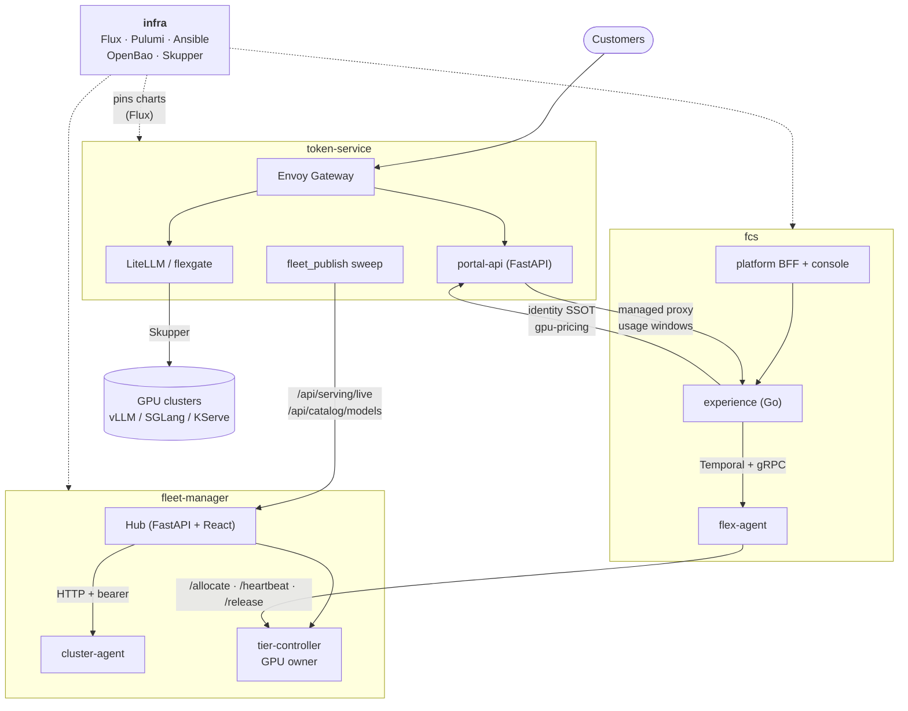
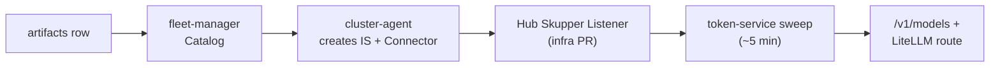
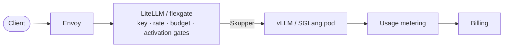
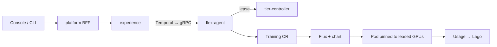

# Flex AI Platform Architecture

> How **token-service**, **fleet-manager**, **fcs** and **infra** fit together.

**Basis:** parallel read-only analysis of each repo (docs, entry points, cross-repo grep). Runtime behaviour was not verified. Dated migration plans and runbooks are decision records, not current state.

## Contents

1. [The big picture](#1-the-big-picture)
2. [System diagram](#2-system-diagram)
3. [The four repos](#3-the-four-repos)
4. [Cross-repo connections](#4-cross-repo-connections)
5. [Key flows](#5-key-flows)
6. [Shared infrastructure](#6-shared-infrastructure)
7. [Gotchas](#7-gotchas)
8. [Where to start reading](#8-where-to-start-reading)

---

## 1. The big picture

| Repo | One-line role |
|---|---|
| **token-service** | Customer-facing inference API (`api.flex.ai/v1`) plus billing and identity back-office. Sells tokens; runs no GPUs. |
| **fleet-manager** | Admin control plane for the GPU fleet. Decides which GPUs run which models and tells token-service what is serving and sellable. |
| **fcs** | "fcsv1" PaaS for GPU training and dedicated inference: console, CLI, Go backend, in-cluster operator. |
| **infra** | GitOps/IaC monorepo that deploys the other three (Flux, Pulumi, Ansible). |

The same physical GPU clusters (e.g. smc-001) serve both token-service inference and fcs training. fleet-manager's `tier-controller` arbitrates GPU ownership.

---

## 2. System diagram

---

## 3. The four repos

<b>3.1 token-service</b>: inference gateway and billing

**Role:** OpenAI-compatible API, virtual keys, rate limits, budgets, metering, Stripe/wallet/credit-ledger billing, portal SPA, customer docs source.

**Components** (namespace `token-service`)

| Component | Notes |
|---|---|
| LiteLLM proxy | Custom hooks in `backend/litellm_hooks/`: admission, usage guard, rpm gate, request validator, activation gate |
| flexgate | Go data plane being introduced beside LiteLLM (Redis Lua, Pub/Sub usage logs) |
| portal-api | FastAPI, one image. `APP_ROLE` = `control`, `media`, `worker` (all billing loops) or `usage-ingest` |
| portal | React SPA behind nginx |
| statuspage-sync | 5-minute CronJob publishing status.flex.ai alerts |

**Request path:** Envoy → `/v1/*` to LiteLLM (carve-outs to portal-api for images, audio, videos, models, pricing) · `/api/*` to portal-api · `/*` to the SPA. LiteLLM then reaches model pods on GPU clusters over Skupper listeners (`k8s/skupper-hub/`).

**Data**
- Postgres via raw asyncpg; all SQL in `backend/database.py`. No ORM.
- `global` schema (orgs, billing, ledger) is split from regional tables (keys, usage). No SQL may join across them (`make db-guard`).
- Numbered migrations in `backend/migrations/` and `backend/migrations-regional/`.

**Catalog:** tables `model_display`, `model_route`, `model_pricing`. `backend/fleet_publish.py` is the only writer, sweeping every ~5 min with brakes: observe-only, per-sweep caps, and "no signal means no write".

**Auth:** Ory OIDC with a BFF cookie session. token-service is the SSOT for users and orgs.

**Deploy:** GKE + Flux. Dev floats on main; staging is pinned per RC; prod is promoted by a human-reviewed infra PR.

**Read first:** `docs/end-to-end-architecture.md`, `docs/fleet-publish-sweep.md`, `backend/fleet_publish.py`.

<b>3.2 fleet-manager</b>: GPU and model control plane

**Role:** Teleport-gated admin UI with Clusters, Models and Catalog tabs. Owns serving placement, perf scorecards and Catalog operator facts. `flexaihq/artifacts` owns prices, context, quant and legal facts. The contract is `ai-specs/contracts/artifacts-fleet-contract.toml` (locked, v1.1.0).

**Components**

| Component | Where | Job |
|---|---|---|
| Hub | `backend/`, `portal/` | FastAPI + React in one image, own Postgres |
| cluster-agent | one per GPU cluster | Inventory, scaling, stage jobs, weight purge |
| tier-controller | one per GPU cluster | Admission webhook on KServe pods, 60s decision loop, defrag, external lease API |
| snapshot-plane | `snapshot-plane/` | GPU snapshot/restore |
| tt-device-plugin, tt-exporter | `tt-*/` | Tenstorrent support |
| serving images and servers | `serving-images/`, `audex-serve`, `parakeet-serve`, `wan-serve` | vLLM patches, custom model servers |

**Hub ↔ cluster:** HTTP with a bearer over Skupper (`backend/cluster_agent_client.py`, `fleet_cache.py`). Mutations write an audit row in the same transaction.

**Tiering:** `desired_hot = clamp(demand, max(floor,1), ceiling)`. Only cold park remains (drain, delete, restore from snapshot or cold boot). Warm and hibernate parking were retired 2026-09-05.

**Read first:** `docs/model-publishing.md`, `backend/main.py`, `tier-controller/src/tier_controller/webhook.py`.

<b>3.3 fcs</b>: training and dedicated-inference PaaS

**Role:** `flexai training run` and `flexai inference serve`, the console at console.flex.ai, and the CLI.

| Layer | Stack | Job |
|---|---|---|
| `platform/` | Python 3.12 FastAPI, React 19, Go CLI | Stateless BFF, console, CLI, generated clients (do not hand-edit) |
| `experience/` | Go, Gin, GORM, Atlas, Temporal | System of record; owns Postgres |
| `experience/flex-agent` | Go operator | Runs workloads in GPU clusters |

**Orchestration:** the backend pushes desired state over a clusterlink gRPC stream tunneled by Skupper. flex-agent creates `compute.flex.ai` Training/Inference CRs; Flux renders the `flexai-training` chart.

**Billing:** a batch job (every 10 min) reads the experience DB and pushes GPU-hours × rate to Lago. It does not meter tokens.

**GPU leasing:** flex-agent calls tier-controller `POST /allocate`, then pins pods with `NVIDIA_VISIBLE_DEVICES=GPU-<uuid>`. There is no device-plugin fallback. Leases live in tier-controller memory, so a 404 on heartbeat triggers re-allocation.

**Read first:** `docs/architecture.md`, `docs/workload-runbook.md`, `experience/flex-agent/internal/controller/`.

<b>3.4 infra</b>: the deployer

**Role:** desired state of every cluster (`k8s/`), cloud/secrets/DNS provisioning (`pulumi/`), host and cluster bring-up (`ansible/`, workflows).

| Piece | Notes |
|---|---|
| `k8s/clusters.yaml`, `k8s/environments.yaml` | Rendered by `make generate-resources` into `k8s/<cluster>/`. **Never hand-edit generated dirs.** |
| `pulumi/` | Python; state in a GCS bucket with KMS |
| `ansible/`, `byoc-tool/` | Host/k3s setup; customer BYOC clusters on AWS/Azure |
| OpenBao | Vault fork; consumed via vault-secrets-operator |
| `.github/workflows/` | ~70 workflows: onboarding, Pulumi, e2e, chart publishing |

**Tiers:** INFRA-DEV → INTERNAL-STAGING → INTERNAL-PROD → CLIENT-PROD.

**Topology**
- GKE control planes (project `fcs-production-cluster`): backoffice (OpenBao, Teleport, fleet-manager, staging token-service) and prod token-service (US/EU).
- k3s GPU/edge clusters: smc-001, mi300x, jarvis, Tenstorrent, arm64, BYOC templates.
- fcs's control plane is being folded into the prod token-service cluster (plan dated 2026-07-28). Scaleway is being decommissioned.

**Read first:** `AGENTS.md`, `k8s/clusters.yaml`, `scripts/src/flexai/`, the `runbook-*.md` files.

---

## 4. Cross-repo connections

### Runtime calls

| From | To | What |
|---|---|---|
| token-service | fleet-manager | Polls `GET /api/serving/live` and `GET /api/catalog/models` (shared bearer, Skupper) |
| fleet-manager | cluster-agent, tier-controller | HTTP + bearer over Skupper |
| fcs flex-agent | tier-controller (fleet-manager) | `POST /allocate`, `/heartbeat/{lease}`, `/release/{lease}` |
| fcs | token-service | User/org SSOT, `gpu-pricing/lookup`; billing verdict returns via `PUT /admin/organization/{id}/billing-block` |
| token-service | fcs | `/api/managed/v1/*` proxy (injects `X-Ory-User-Id`); pulls `/admin/usage/windows` |

fleet-manager has no code dependency on fcs. The only link is lease metadata (`display_name`, `org_name`) so its cluster page shows names.

### Build and deploy links

| Link | Detail |
|---|---|
| infra → all three | HelmRepository + HelmRelease per chart, versions pinned in `k8s/environments.yaml` and `k8s/clusters.yaml` |
| token-service ↔ infra | Pin workflows edit `clusters.yaml`; merged pins dispatch release events back |
| fleet-manager → infra | Dispatches infra workflows: cluster deploy, onboarding, Skupper listener PRs |
| infra → fleet-manager | Cluster-enrol workflow dispatches fleet-manager to edit its listener roster |
| fcs UI → token-service portal | Console frontend vendored into `portal/src/managed-console/` (hash-checked) |

### Key files

| Edge | Files |
|---|---|
| Fleet feeds | token-service `backend/fleet_publish.py`, `fleet_liveness.py` · fleet-manager `backend/serving_registry_api.py`, `catalog_api.py` |
| Hub to agents | fleet-manager `backend/cluster_agent_client.py` |
| GPU lease | fcs `experience/flex-agent/internal/tierclient/` · fleet-manager `tier-controller/` |
| Identity SSOT | fcs `experience/backend/internal/tokenservice/client.go` |
| Managed proxy | token-service `backend/managed_proxy.py`, `managed_usage_client.py` |
| GitHub dispatch | fleet-manager `backend/github_client.py` · infra `.github/workflows/setup_k3s_training_cluster.yml` |
| Pins | infra `scripts/set_token_service_pin.py`, `.github/workflows/token-service-*.yml` |

---

## 5. Key flows

### Publish a model

### Inference request

### Training job

### Deploy

1. A repo publishes a chart to GAR.
2. A bot PR to infra bumps the pin.
3. Merge; Flux applies it.
4. Prod promotion is a human-reviewed PR.

### Identity

token-service is the SSOT. fcs resolves the Ory subject through it (60s cache, fails open to the local mirror). The feature is dormant unless both the URL and token env vars are set.

---

## 6. Shared infrastructure

| Piece | Notes |
|---|---|
| **Skupper** | Cross-cluster plumbing. Hub listeners on the GKE token-service clusters (infra-owned via Flux); serving clusters hold connectors. Listener port must equal Connector port. |
| **GAR** | All app charts and images publish to `us-west2-docker.pkg.dev/fcs-production-cluster/*` |
| **Ory** | auth.flex.ai points at token-service's Ory project |
| **Teleport** | Fronts fleet-manager |
| **OpenBao** | Secrets for all clusters; per-cluster JWT auth mounts |

---

## 7. Gotchas

<b>infra and deploys</b>

- Never hand-edit infra's generated `k8s/<cluster>/` dirs, and never `kubectl edit` live resources; Flux/VSO overwrites them.
- Never run infra `secrets-sync` without the `VAULT_ADMIN_INFRA_DEV_*` credentials; it deletes fcsv1 training auth.
- A `spec.suspend: true` HelmRelease blocks Flux from picking up value changes.
- Publishing a fleet-manager chart rolls the whole fleet. `make deploy-agent` and `make deploy-tier-controller` are break-glass only (suspend the HelmRelease first).

<b>token-service and fleet-manager</b>

- Adding a model is not a token-service change. Use artifacts plus the fleet-manager Catalog. Do not hand-UPDATE catalog columns the sweep re-asserts.
- Any `/v1` route carve-out needs a change in both token-service (chart) and infra (edge Gateway).
- Prod fleet-feed flags (`SERVING_FEED_PER_ARM` and others) are ordered against token-service deploys. Check before flipping.
- Teleport JWT audience for fleet-manager must be the internal Service URI, or it looks like a missing role.

<b>fcs and GPU leasing</b>

- tier-controller leases are in memory. A restart drops them and flex-agent re-allocates.
- A 403 in Vault namespace `admin` means a missing mount, not permissions.
- `enqueued` does not mean waiting for GPUs. Debug in order: CRD, Kueue, pod, VaultStaticSecret, Vault.
- Never edit generated clients under `platform/api/*/client`.

<b>documentation drift</b>

- fcs `CLAUDE.md` claims `token-service/` is in its monorepo. It is not.
- token-service `CLAUDE.md` references a `cluster-agent/` dir that does not exist there; it lives in fleet-manager.
- token-service `docs/architecture.md` is a stale 2026-04 snapshot; use `docs/end-to-end-architecture.md`.

---

## 8. Where to start reading

| Goal | Start at |
|---|---|
| Whole-system picture | token-service `docs/end-to-end-architecture.md` |
| Model publishing | fleet-manager `docs/model-publishing.md` |
| GPU scheduling | fleet-manager `tier-controller/docs/autoscaling-state-machine.md`, `external-allocation-api.md` |
| Training workflow | fcs `docs/architecture.md`, `docs/workload-runbook.md` |
| Identity/org SSOT | fcs `docs/auth-ssot-consolidation-plan.md`, `docs/eng-1492-handoff/` |
| Deploy and release | infra `AGENTS.md`, token-service `docs/release-process.md`, fcs `docs/release-and-deploy.md` |
| Incidents and history | infra `runbook-*.md`, `migration-plan-*.md` |
